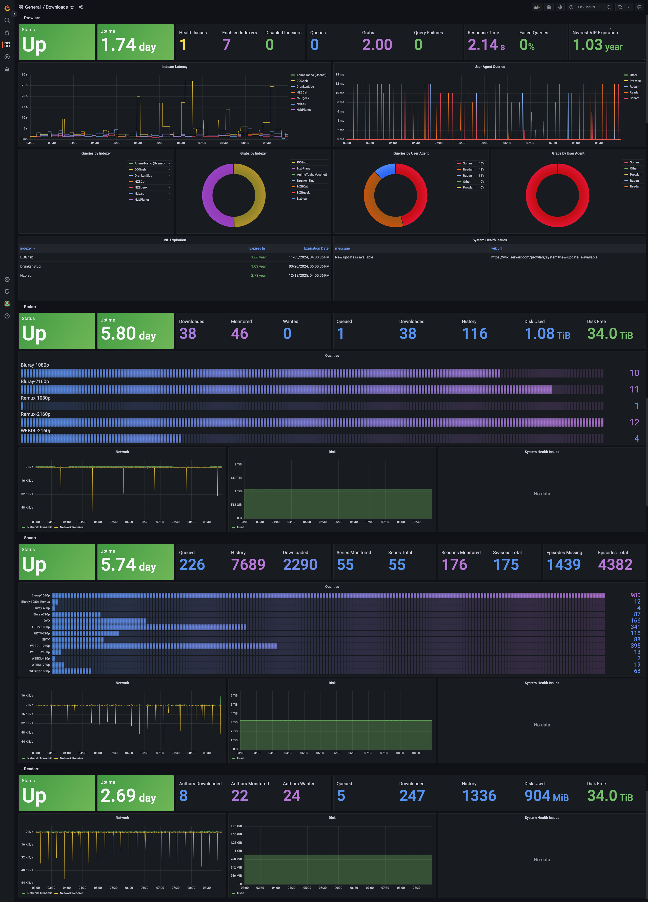

<div align="center">

# k8s-mediamanager

_An all-in-one Opiniated Kubernetes media manager helm chart built with security in mind._

</div>

<div align="center">


</div>

Allows you to create a fully working and complete media manager on #kubernetes, respecting the latest [security best practices](https://github.com/kubernetes-sigs/kubebuilder/discussions/2840): 
- Rootless containers
- Enforce strict *pod-level* `podSecurityContext` for all pods at the runtime level: 
    ```
    securityContext:
        runAsNonRoot: true
        runAsUser: {{ .Values.general.puid }}
        runAsGroup: {{ .Values.general.pgid }}
        fsGroup: {{ .Values.general.pgid }}
        seccompProfile:
          type: RuntimeDefault
    ```

- Enforce strict *container-level* `securityContext` with all capabilites dropped and no priviledge escalation:
    ```
    securityContext:
        allowPrivilegeEscalation: false
        capabilities:
            drop:
            - ALL
    ```
- All public endpoints require authentication, support SSL termination at ingress through CNI anotations (TLS-ACME). -- *No* insecure `nodePort` endpoints.
- All pods runnning dedicated serviceAccount (no access to the k8s API from pods)
- Metrics endpoints and monitoring enabled by default for all apps

The goal of this project is to support [semantically versioned](https://semver.org/), [rootless](https://rootlesscontaine.rs/), and [multiple architecture](https://www.docker.com/blog/multi-arch-build-and-images-the-simple-way/) containers for various applications. Container images used by the chart are from [oneDrop](https://github.com/onedr0p/containers). If you have questions regarding the images, ask there.

Currently based on:

- [Plex Media Server](https://www.plex.tv/ "Plex Media Server") - A complete and fully funtional mediaserver that allows
you to render in a webUI your movies, TV Series, podcasts, video streams.

- [Sonarr](https://sonarr.tv/ "Sonarr") - A TV series and show tracker, that allows the integration with download managers
for searching and retrieving TV Series, organizing them, schedule notifications when an episode comes up and much more.

- [Radarr](https://radarr.video/ "Radarr") - The same a **Sonarr**, but for movies!

- [Lidarr](https://github.com/Lidarr/Lidarr "Lidarr") - Looks and smells like Sonarr but made for music.

- [Prowlarr](https://github.com/Prowlarr/Prowlarr "Prowlarr") - An indexer manager/proxy built on the popular \*arr .net/reactjs base stack to integrate with your various PVR apps. Prowlarr supports management of both Torrent Trackers and Usenet Indexers.

- [Transmission](https://transmissionbt.com/ "Transmission") - A fast, easy and reliable torrent client.

Each of the components can be **enabled** or **disabled** if you already have something in place in your environment.

**Pull requests to add support for more are welcome**

## Requirements
- Kubernetes 1.25+, tested on 1.30.5
- A CSI supporting `ReadWriteMany` accessmode for the media library. Tested with [nfs-ganesha-server-and-external-provisioner](https://github.com/kubernetes-sigs/nfs-ganesha-server-and-external-provisioner?tab=readme-ov-file)
- A CNI supporting LoadBalancer services. We strongly recommend Cilium, Although not recommended, You can also edit your `values.yaml` to use `nodePorts` otherwise.
- OPTIONAL: A TLS-ACME cluster-issuer. Although optional, we strongly recommend you setup `letsencrypt` on your cluster for production deployments (public endpoints).
- OPTIONAL: A `kube-prometheus-stack` instance in order to enable monitoring/alerting


## Deployment

[Helm](https://helm.sh) must be installed to use the charts.  Please refer to
Helm's [documentation](https://helm.sh/docs) to get started.

Once Helm has been set up correctly, add the repo as follows:
  
    helm repo add k8s-mediamanager https://sekops-ch.github.io/k8s-mediamanager

If you had already added this repo earlier, run `helm repo update` to retrieve
the latest versions of the packages.  You can then run `helm search repo
k8s-mediamanager` to see the charts.

To install the k8s-mediamanager chart:

    helm upgrade --install -n <namespace> -f values.yaml kmm k8s-mediamanager/k8s-mediamanager --create-namespace

To uninstall the chart:

    helm delete -n <namespace> kmm

To upgrade all components of the chart simply run `helm repo update` and run the installation command again.

A sample minimum `values.yaml` for a prod deployment with SSL, and proper config segmentation is provided below :

```
general:
  ingress_host: services.endpoint.io
  plex_ingress_host: plex.endpoint.io
  sharedStorage:
    size: 5Gi
    storageClassName: "nfs"
    persistentVolumeClaim:
      claimName: "my-media-library" 

plex:
  ingress:
    annotations:
      ingress.cilium.io/loadbalancer-mode: shared
      kubernetes.io/tls-acme: "true"
    tls: 
      enabled: true

  volume:
    storageClassName: "sa" # Used for config, put whatever ReadWriteOnce SC you have here

prowlarr:
  apiKey: "438c234cca4e4784b1eecfc12ae69f33" # Change this prior to deploying
  ingress:
    annotations:
      ingress.cilium.io/loadbalancer-mode: shared
      kubernetes.io/tls-acme: "true"
    tls:
      enabled: true
  volume:
    storageClassName: "sa" # Used for config, put whatever ReadWriteOnce SC you have here

radarr:
  apiKey: "438c234cca4e4784b1eecfc12ae69f33" # Change this prior to deploying
  ingress:
    annotations:
      ingress.cilium.io/loadbalancer-mode: shared
      kubernetes.io/tls-acme: "true"
    tls:
      enabled: true
  volume:
    storageClassName: "sa" # Used for config put whatever ReadWriteOnce SC you have here

sonarr:
  apiKey: "438c234cca4e4784b1eecfc12ae69f33" # Change this prior to deploying
  ingress:
    annotations:
      ingress.cilium.io/loadbalancer-mode: shared
      kubernetes.io/tls-acme: "true"
    tls:
      enabled: true
  volume:
    storageClassName: "sa" # Used for config put whatever ReadWriteOnce SC you have here

lidarr:
  apiKey: "438c234cca4e4784b1eecfc12ae69f33" # Change this prior to deploying
  ingress:
    annotations:
      ingress.cilium.io/loadbalancer-mode: shared
      kubernetes.io/tls-acme: "true"
    tls:
      enabled: true
  volume:
    storageClassName: "sa" # Used for config put whatever ReadWriteOnce SC you have here

transmission:
  ingress:
    annotations:
      ingress.cilium.io/loadbalancer-mode: shared
      kubernetes.io/tls-acme: "true"
    tls:
      enabled: true
  config:
    auth:
      enabled: true
      username: "admin"
      password: "admin12345"
  volume:
    storageClassName: "sa" # Used for config put whatever ReadWriteOnce SA you have here
```

See the chart [values.yaml](charts/k8s-mediamanager/values.yaml) for more details on available parameters.

If you already have pre-existing volumes you can patch them using the `helm-adopt.sh` script to avoid having the 
`error : resources already exist` issue when running the install script

## Usage

Upon deploying the chart with the command above the following endpoints will become available externally:

```
<general.ingress_host>:443/<service> # Services UIs: where service=[radarr,sonarr,prowlarr,transmission]
<general.plex_ingress_host>:443/     # Plex UI
<TRANSMISSION_LOADBALANCER_IP>:<transmission.container.port.peer> # transmission peer protocol endpoint
```

Where `general.ingress_host`, `general.plex_ingress_host`, `transmission.container.port.peer` are defined in your `values.yaml, 
and `TRANSMISSION_LOADBALANCER_IP` is the public IP assined by your loadbalancer to the transmission loadbalancer service. 
Assuming you left the default values above, You can get it by running `kubectl get svc -n <namespace> kmm- transmission-peer` and watch for the `EXTERNAL_IP` field.

## Changing the configuration of services
**-arr services are configured to setup authentication upon first start. It is strongly recommended to connect to your -arr services
and setup authentication.**

All services start with a default configuration set from the chart. Transmission allows to update the configuration from the chart directly (stateless), while
-arr aps are stateful and require you to drop into a shell and edit the config manually. You can do so by running 
```
kubecetl exec -it deployment/<*-arr> k8s-mediamanager -- sh
```

you can then edit the config files in `/config` of each container. In the future, we might update the chart to make configuration management of -arr apps easier

## Metrics and monitoring



The chart adds an [exportarr](https://github.com/onedr0p/exportarr) sidecar to all *-arr apps. 
It also adds the dashboard config as a `configMap` in the environment. The dashboard will automatically
be added to your Graphana instance. Feel free to edit and submit Pull Requests on the dashboard.

## TODO
- [X] Finish adding support for serviceAccount
- [X] Add support for lidarr
- [X] Add metrics for Plex (Tautulli)
- [X] Add metrics for transmission
- [ ] Add support for Readarr
- [ ] Add support for sabnzbz
- [ ] Add support for Overseer
- [ ] Add support for Requestrr
- [ ] Fix transmission dashboard
- [ ] move secrets to secrets API

